Houdini Tested on Houdini 20.5 and Python 3.11
To install, add folder to HOUDINI_PATH environment variable.
[Playlist of videos showing how to use the tools](https://youtube.com/playlist?list=PLUBK6gGjWEeojLKIa3_HQVU8L4jUja_dy)

## FEATURES:

#### Set or append expression to any parameter
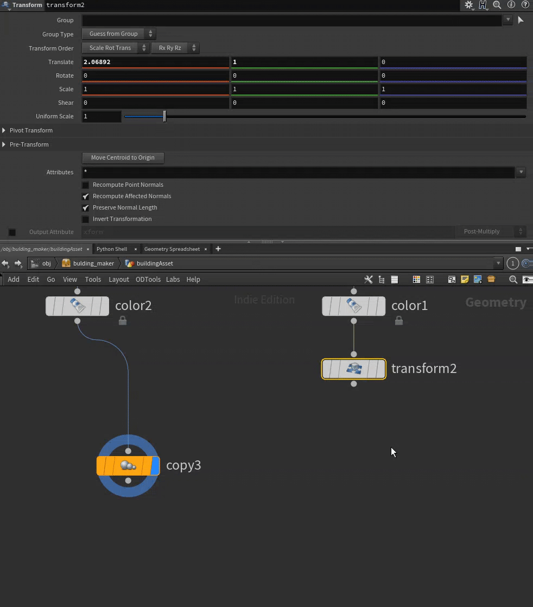

#### Fetch geometry attributes and groups

#### Find channel references in parm

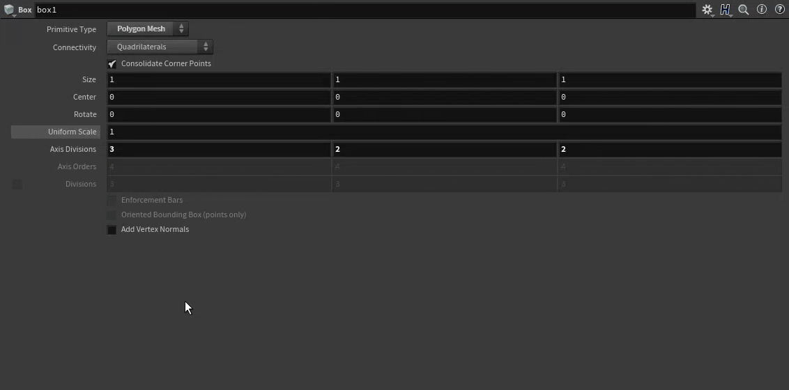

#### Add spare input

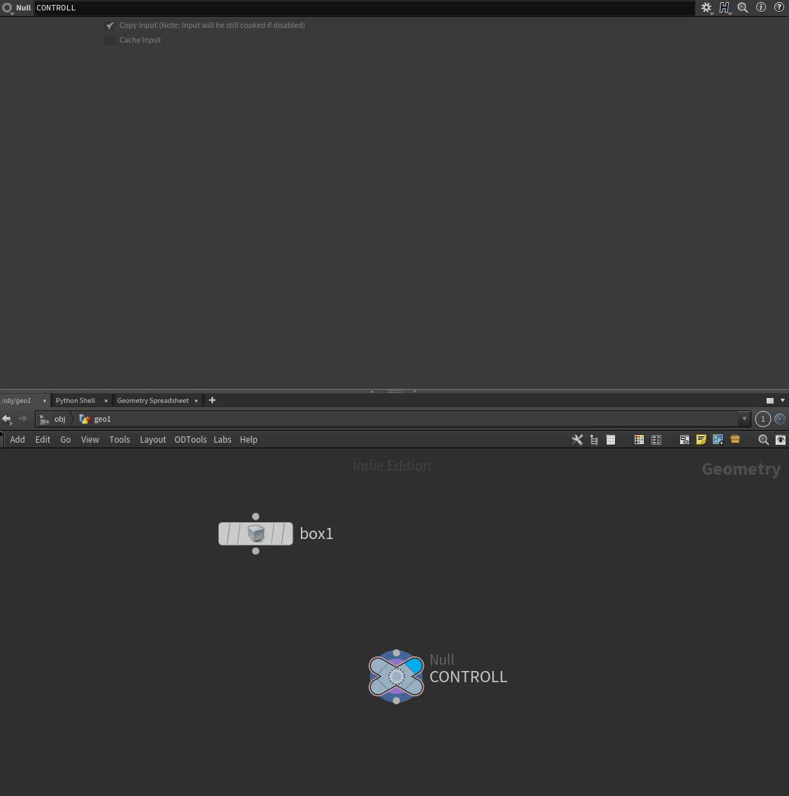

#### Reference parameters from user set node

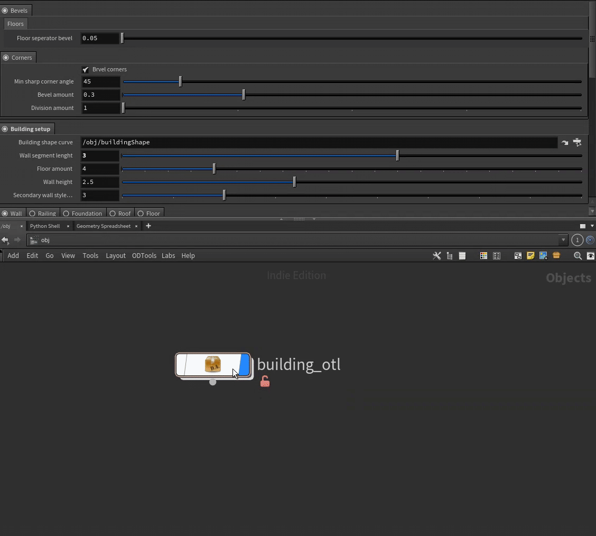

#### Add parameter to user set node as a spare or HDA definition parm

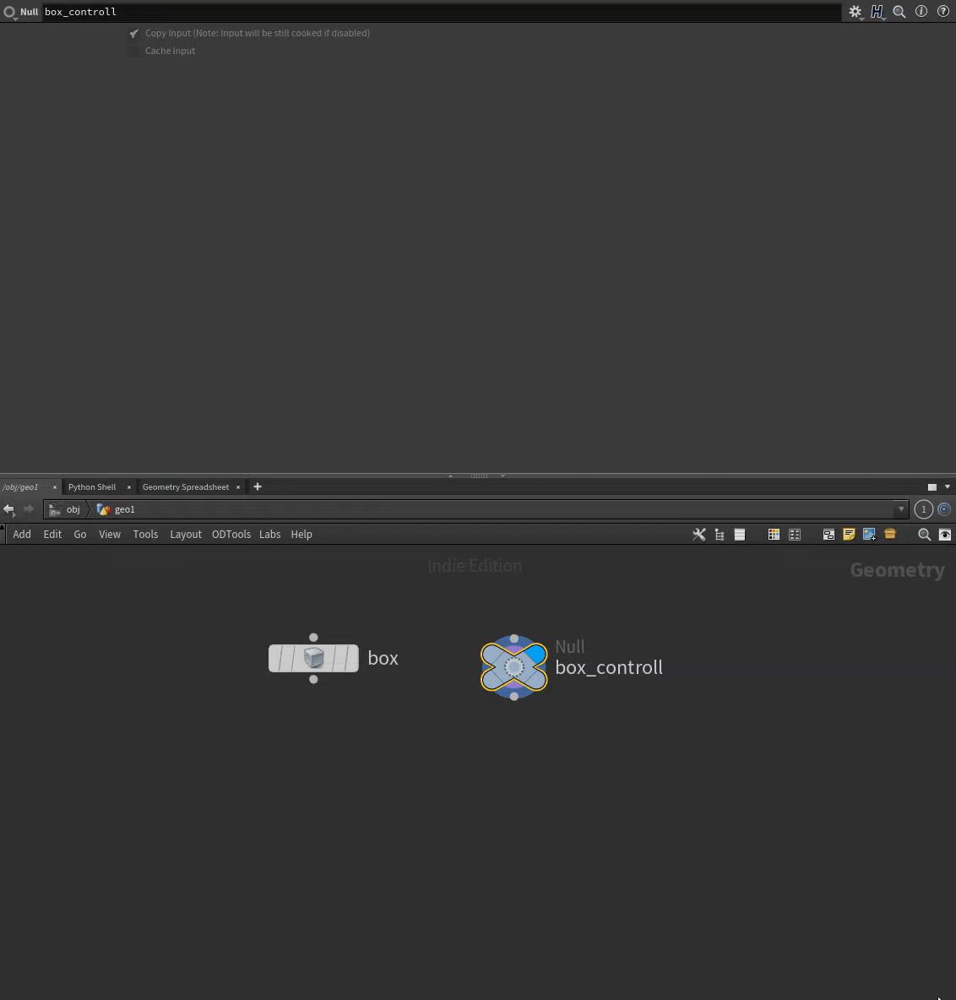

#### Visualize/rename geometry groups

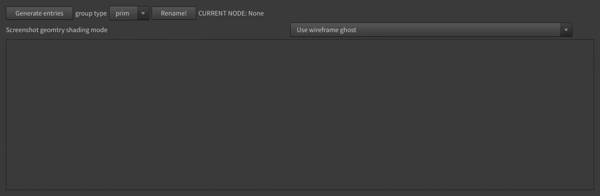

#### Open with multiple external editors

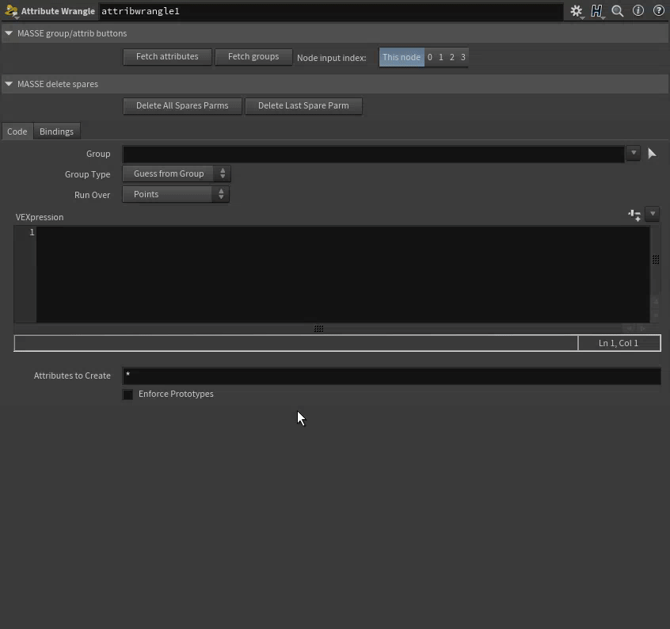

#### Rename multiple nodes

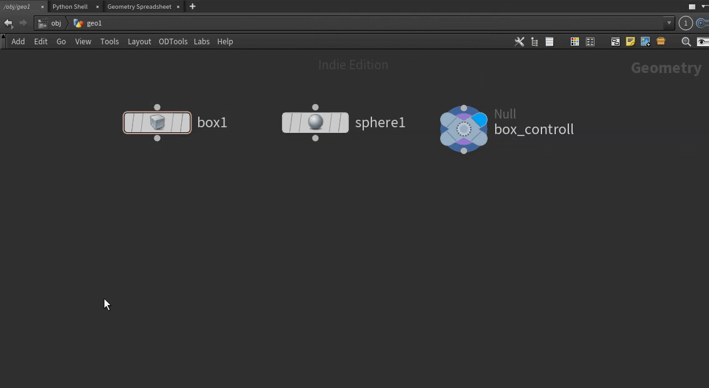

#### Remove single parameter 

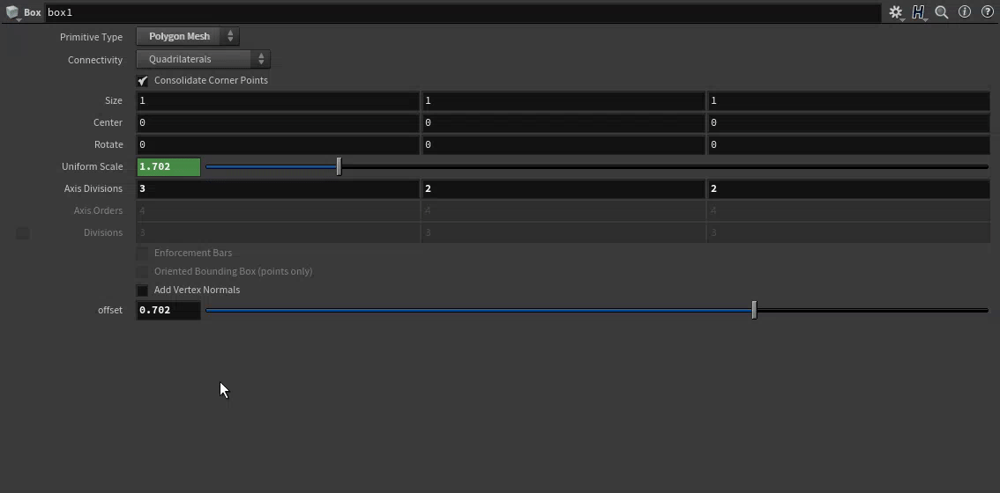

#### Add parameter to multiparm folder

#### Get pdg attributes

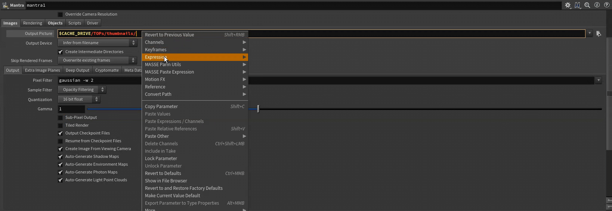

#### Get pdg input/output tags

#### Object merge selected nodes

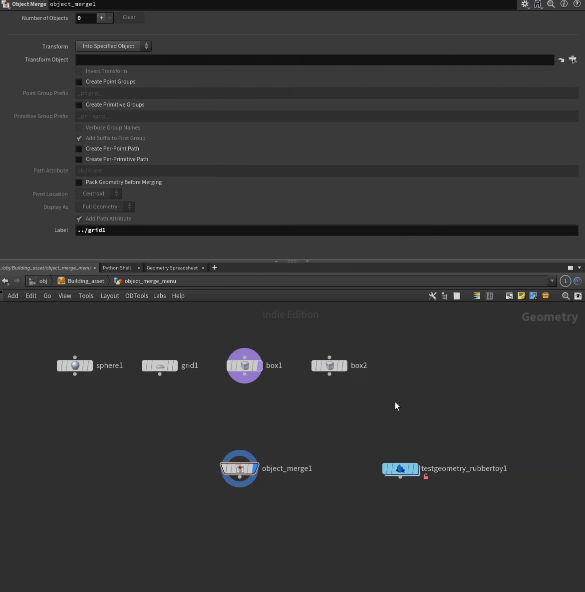
