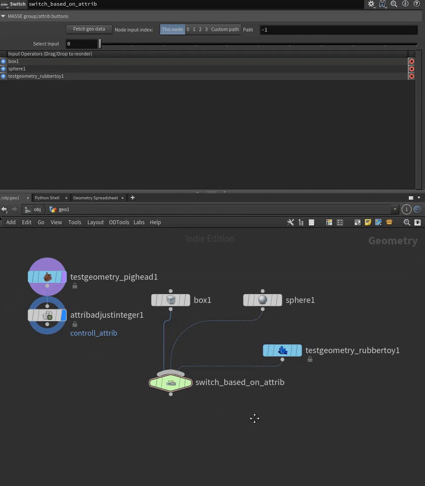

Tested on Houdini 21.0 and Python 3.11
To install, add folder to HOUDINI_PATH environment variable.

You can support my work/development of the package:

  
   
  

 

## FEATURES:

#### Set or append expression to any parameter

#### Fetch geometry attributes and groups

#### Find channel references in parm

#### Add spare input

#### Reference parameters from user set node

#### Add parameter to user set node as a spare or HDA definition parm

#### Visualize/rename geometry groups

#### Open with multiple external editors

#### Rename multiple nodes

#### Remove single parameter 

#### Add parameter to multiparm folder

#### Get pdg attributes

#### Get pdg input/output tags

#### Object merge selected nodes

